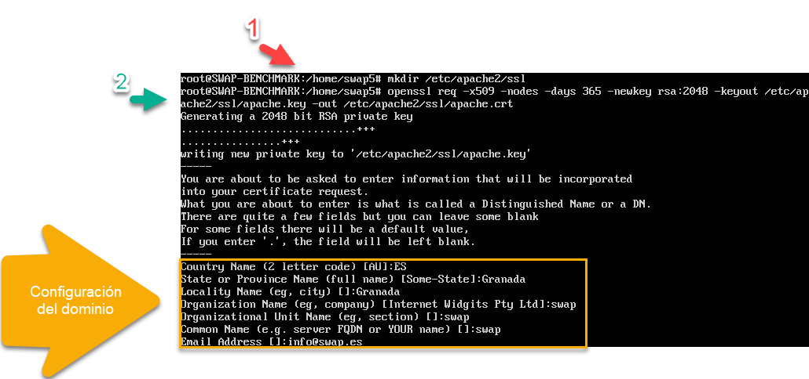
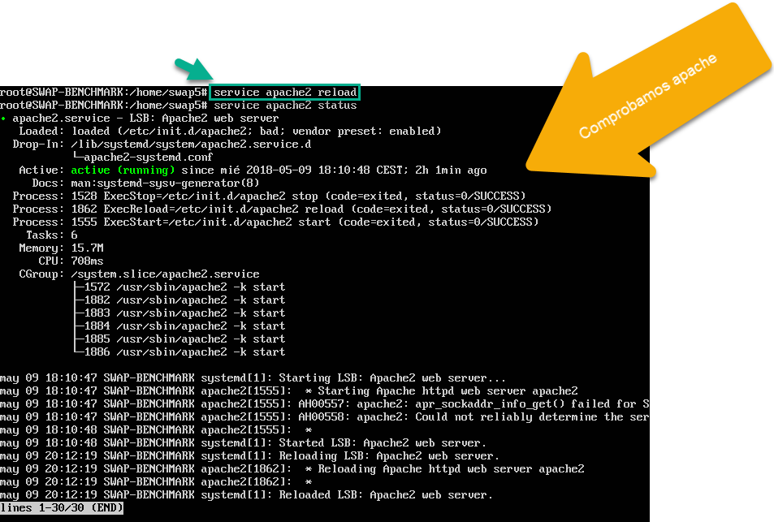
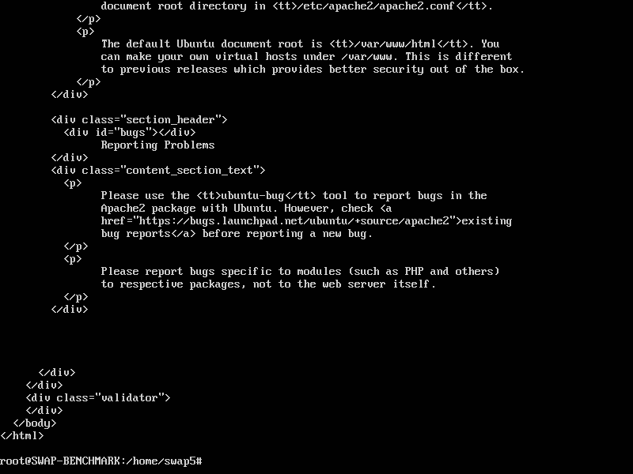

# Práctica 4. Asegurar la granja web #

## Instalar un certificado SSL autofirmado para configurar el acceso por HTTPS

Un **certificado SSL** sirve para brindar seguridad al visitante de su página web, una
manera de decirles a sus clientes que el sitio es auténtico, real y confiable para
ingresar datos personales.

El **protocolo SSL** (Secure Sockets Layer) es un protocolo de comunicación que se
ubica en la pila de protocolos sobre **TCP/IP. SSL** proporciona servicios de
comunicación segura entre cliente y servidor, como por ejemplo autenticación (usando
certificados), integridad (mediante firmas digitales), y privacidad (mediante
encriptación).

La versión actual es la SSLv3, que se considera insegura. El nuevo estándar se llama
**TLS** (Transport Layer Security).

Existen diversas formas de obtener un certificado SSL e instalarlo en nuestro servidor
web para poder servir páginas mediante el protocolo **HTTPS**, para ello, lo principal es
conseguir un certificado que podremos conseguir de las siguientes formas:

  - Mediante una autoridad de certificación.
  - Crear nuestros propios certificados SSL auto-firmados usando la herramienta openssl.
  - Utilizar certificados del proyecto Certbot (antes Let’s Encrypt).

### Generar e instalar un certificado autofirmado ###
Para generar un certificado SSL autofirmado en Ubuntu Server solo debemos activar
el módulo SSL de Apache, generar los certificados y especificarle la ruta a los
certificados en la configuración. Así pues, como root ejecutaremos:

~~~~
a2enmod ssl
~~~~

~~~~
service apache2 restart
~~~~

Comprobamos su estado para verificar que todo este bien.

~~~~
mkdir /etc/apache2/ssl
openssl req -x509 -nodes -days 365 -newkey rsa:2048 -keyout /etc/apache2/ssl/apache.key -out /etc/apache2/ssl/apache.crt
~~~~

**Nos pedirá una serie de datos para configurar el dominio.**
- 1. Generamos la carpeta que contendra los fichero SSL
- 2. Insertamos el comando para generar el fichero de configuracion de dominio.

**Editamos el archivo de configuración del sitio default-ssl:**

~~~~
nano /etc/apache2/sites-available/default-ssl.conf
~~~~

Y agregamos estas lineas debajo de donde pone SSLEngine on:

**Activamos el sitio default--ssl y reiniciamos apache:**

~~~~
a2ensite default-ssl
~~~~

~~~~
service apache2 reload
~~~~

Una vez reiniciado Apache, accedemos al servidor web mediante el protocolo HTTPS y veremos, si estamos accediendo con un navegador web, que en la barra de dirección sale en rojo el https, ya que se trata de un certificado autofirmado.

**Para hacer peticiones por HTTPS utilizando la herramienta curl, ejecutaremos:**

~~~~
curl –k https://ipmaquina1/index.html
~~~~

---

## Configuración del cortafuegos

Un cortafuegos es un componente esencial que protege la granja web de accesos indebidos. Son dispositivos colocados entre subredes para realizar diferentes tareas de manejo de paquetes. Actúa como el guardián de la puerta al sistema web, permitiendo el tráfico autorizado y denegando el resto.

En general, todos los paquetes TCP/IP que entren o salgan de la granja web deben pasar por el cortafuegos, que debe examinar y bloquear aquellos que no cumplan los criterios de seguridad establecidos. Estos criterios se configuran mediante un conjunto de reglas, usadas para bloquear puertos específicos, rangos de puertos, direcciones IP, rangos de IP, tráfico TCP o tráfico UDP.

### Configuración del cortafuegos iptables en Linux
