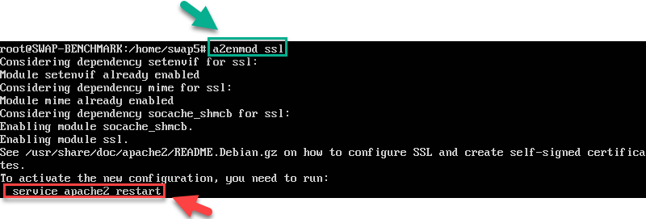

# Práctica 4. Asegurar la granja web #

## 2. Instalar un certificado SSL autofirmado para configurar el acceso por HTTPS

Un **certificado SSL** sirve para brindar seguridad al visitante de su página web, una
manera de decirles a sus clientes que el sitio es auténtico, real y confiable para
ingresar datos personales.

El **protocolo SSL** (Secure Sockets Layer) es un protocolo de comunicación que se
ubica en la pila de protocolos sobre **TCP/IP. SSL** proporciona servicios de
comunicación segura entre cliente y servidor, como por ejemplo autenticación (usando
certificados), integridad (mediante firmas digitales), y privacidad (mediante
encriptación).

La versión actual es la SSLv3, que se considera insegura. El nuevo estándar se llama
**TLS** (Transport Layer Security).

Existen diversas formas de obtener un certificado SSL e instalarlo en nuestro servidor
web para poder servir páginas mediante el protocolo **HTTPS**, para ello, lo principal es
conseguir un certificado que podremos conseguir de las siguientes formas:

  - Mediante una autoridad de certificación.
  - Crear nuestros propios certificados SSL auto-firmados usando la herramienta openssl.
  - Utilizar certificados del proyecto Certbot (antes Let’s Encrypt).

### Generar e instalar un certificado autofirmado ###
Para generar un certificado SSL autofirmado en Ubuntu Server solo debemos activar
el módulo SSL de Apache, generar los certificados y especificarle la ruta a los
certificados en la configuración. Así pues, como root ejecutaremos:

~~~~
a2enmod ssl
~~~~

~~~~
service apache2 restart
mkdir /etc/apache2/ssl
openssl req -x509 -nodes -days 365 -newkey rsa:2048 -keyout /etc/apache2/ssl/apache.key -out /etc/apache2/ssl/apache.crt
~~~~

Nos pedirá una serie de datos para configurar el dominio.
