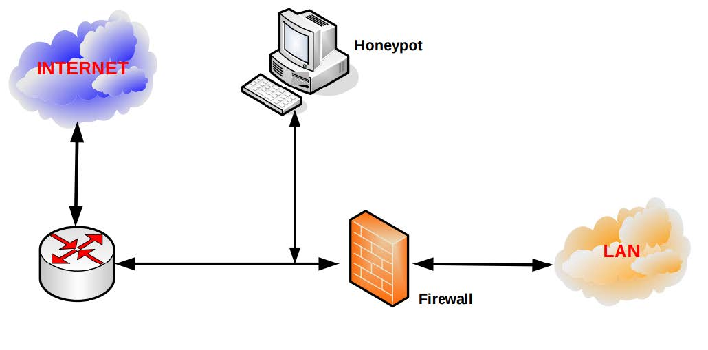
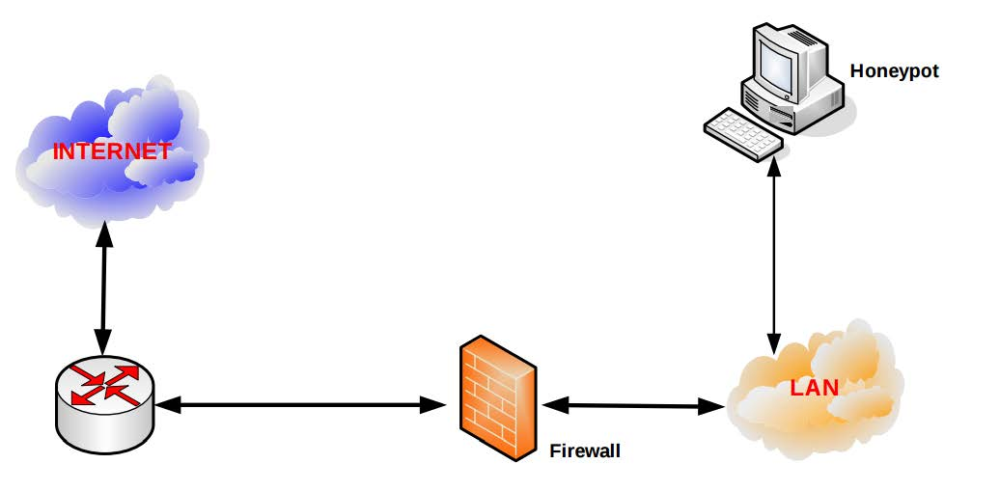
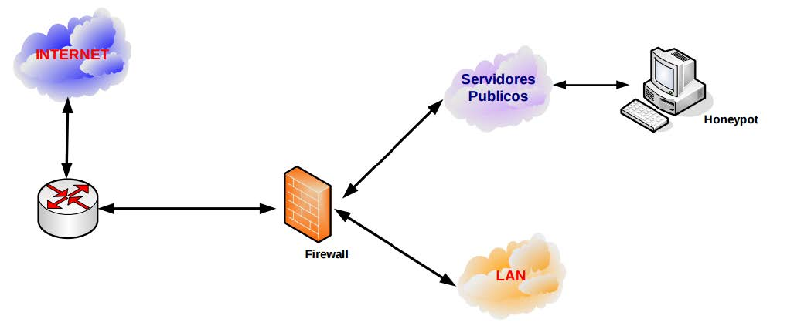
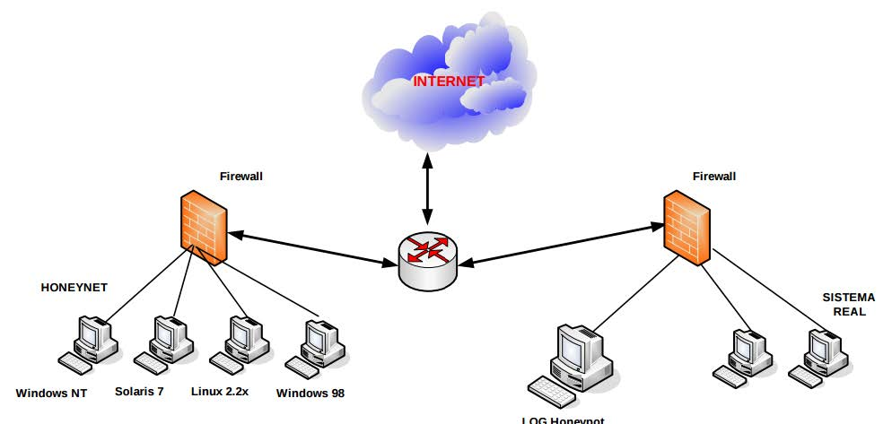

# HoneyPots

## Introducción.

Los ataques a servidores conectados a Internet siguen aumentando cada año. La complejidad de los métodos empleados por los atacantes ha ido creciendo paralelamente, al igual que las herramientas que emplean para disimular sus acciones en los equipos una vez que han conseguido acceso al sistema.

Hasta hace algún tiempo los sistemas atacados no solían contener información confidencial, por lo que los administradores procedían a la reinstalación y actualización de estos equipos atacados, para así borrar los binarios y puertas traseras instaladas por los atacantes, continuando posteriormente con la actividad normal del sistema.

En la mayoría de las situaciones, las únicas medidas que se solían adoptar con respecto a los atacantes consistían en la notificación del ataque a los administradores de los equipos origen del ataque, si se llegaba a averiguar, y el envío de un aviso interno a los usuarios del equipo, para que procedieran a cambiar sus claves de acceso. Sin embargo, con este incremento del número de equipos atacados, es cada vez más frecuente el tener que analizar las acciones realizadas por los atacantes en los equipos, por un lado para averiguar el alcance del mismo y, llegado el momento, poder tomar las medidas oportunas para denunciar el ataque a las autoridades competentes y por otro, para llevar a cabo la actualización parcial del equipo, ya que muchas veces no es posible dejar sin servicio a los usuarios para proceder a una instalación completa.

El número de incidentes reportados cada año sigue en aumento, como se puede ver en las estadísticas. Aunque el código de los programas de ataque, o exploit, últimamente no suele aparecer de forma directa en listas de correo y servidores www, es evidente que hay muchos foros de discusión y servidores en Internet donde se pueden obtener estas herramientas ya compiladas, lo que hace que el número de ataques siga creciendo.

Muchas veces se observa que los atacantes no suelen tener conocimientos extensos sobre el funcionamiento general del sistema al que han conseguido acceder: no saben cómo compilar los programas, ni dónde se encuentra la configuración del sistema de logs del equipo, e intentan ejecutar programas pertenecientes a otros sistemas operativos. La mayoría de ellos se limitan a utilizar una serie de programas “precocinados” para borrar los rastros dejados e instalar una serie de binarios precompilados para atacar después otros servidores.

Las dificultades de acceso a los programas que emplean los atacantes impiden muchas veces que los administradores puedan evaluar si un determinado problema de seguridad afecta directamente a los equipos de la institución, teniendo que esperar bien a que los fabricantes del sistema operativo o aplicación distribuyan la versión actualizada del programa o a filtrar determinados servicios al exterior.

Los sistemas de detección de intrusos son una de las herramientas que más ha evolucionado en los últimos años, habiéndose convertido en uno de los principales mecanismos empleados por los administradores de redes para detectar cuándo se produce un ataque, aunque muchas veces no son suficientes para evitar que estos se produzcan.

La dificultad para analizar los binarios instalados en los equipos por los atacantes complica muchas veces la solución de estos ataques. Los administradores deben intentar eliminar todas las puertas traseras que se hayan podido dejar para entrar con facilidad en el equipo, al igual que los programas de recolección de claves que circulan en claro por la red (sniffer) y las herramientas de ataque a otros equipos.

## HoneyPots.

Los Honeypots son una tecnología nueva con enorme potencial para la comunidad informática. Los primeros conceptos fueron introducidos por primera vez por varios íconos en la seguridad informática, especialmente aquellos definidos por Cliff Stoll y Bill Cheswick. Desde entonces, han estado en una continua evolución, desarrollándose de manera acelerada y convirtiéndose en una poderosa herramienta de seguridad hoy en día.

Un Honeypot es un sistema diseñado para analizar cómo los ciberdelincuentes emplean sus armas para intentar entrar en un sistema (analizan las vulnerabilidades) y alterar, copiar o destruir sus datos o la totalidad de éstos (por ejemplo borrando el disco duro del servidor). Por medio del aprendizaje de sus herramientas y métodos se puede, entonces, proteger mejor los sistemas. Pueden constar de diferentes aplicaciones, una de ellas sirve para capturar al intruso o aprender cómo actúan sin que ellos sepan que están siendo vigilados.

Los Honeypots son en su forma más básica son servidores de información falsos, posicionados estratégicamente en una red de prueba, los cuales son alimentados con información falsa que es disfrazada como archivos de naturaleza confidencial. A su vez, estos servidores son configurados inicialmente de manera que sea difícil mas no imposible el hecho de ser penetrados por un atacante informático, exponiéndolos de manera deliberada y haciéndolos altamente atractivos para un “hacker” en busca de un blanco.

Por último, el servidor es habilitado con herramientas de monitoreo y rastreo de información, de manera que cada paso y rastro de actividad de un “hacker” pueda ser registrado en una bitácora que indique esos movimientos de manera detallada.

Las funciones principales de un Honeypot son:
- **Desviar** la atención del atacante de la red real del sistema, de manera que no se comprometan los recursos principales de información.
- **Capturar** nuevos virus o gusanos para su estudio posterior.
- **Formar** perfiles de atacantes y sus métodos de ataque preferidos, de manera similar a la usada por una corporación policiaca para construir el archivo de un criminal basado en su modus operandi.
- **Conocer** nuevas vulnerabilidades y riesgos de los distintos sistemas operativos, entornos y programas las cuales aún no se encuentren debidamente documentadas.

En un contexto más avanzado, un conjunto de Honeypots forma una Honeynet, proporcionando así una herramienta que abarca un conjunto extendido de posibles amenazas y proporciona al administrador de sistemas mayor información para su estudio.

Inclusive, hace más fascinante el ataque para intruso debido a que se incrementan las posibilidades, blancos y métodos de ataque.

### Prevención de ataques.

Los Honeypots nos pueden proteger de diferentes tipo de amenaces entre las que podemos encontrar:

- **Defensa contra ataques automatizados:** Estos ataques son basados en herramientas que aleatoriamente rastrean redes enteras buscando sistemas vulnerables. Si un sistema vulnerable es encontrado, estas herramientas automatizadas atacaran y tomaran el sistema (con gusanos que se replican en la víctima). Uno de las métodos para proteger de tales ataques es bajando la velocidad de su rastreo para después detenerlos. Llamados “Sticky Honeypots”, estas soluciones monitorean el espacio IP no utilizado. Cuando los sistemas son analizados, estos Honeypots interactúan con él y disminuyen la velocidad del ataque.

- **Protección contra intrusos humanos:** Este concepto se conoce como engaño o disuasión. La idea de esta técnica es confundir al atacante y hacerle perder tiempo y recursos mientras interactúa con el Honeypot. Mientras ese proceso se lleva a cabo, se puede detectar la actividad del atacante y se tiene tiempo para reaccionar y detener el ataque. Además podremos mantener un estudio de como un atacante humano se mueve y pretende infiltrarse en nuestro sistema.

- **Métodos de Detección Precisa:** Tradicionalmente, la detección ha sido una tarea extremadamente difícil de llevar a cabo. Las tecnologías como los Sistemas de Detección de Intrusos y sistemas de loggin han sido deficientes por diversas razones: Generan información en cantidades excesivas, grandes porcentajes de falsos positivos (o falsas alarmas), no cuentan con la habilidad de detectar nuevos ataques y/o de trabajar en forma encriptada. Los Honeypots son excelentes en el ramo de la detección, solventando muchos de los problemas de la detección clásica, reducen los falsos positivos, capturan pequeñas cantidades de datos de gran importancia como ataques desconocidos y nuevos métodos de explotación de vulnerabilidades además de poder trabajar de forma encriptada.

- **Labor Ciber-Forense:** Una vez que un administrador de red se da cuenta que uno/s de sus servidores fueron comprometidos ilegalmente, es necesario proceder inmediatamente a realizar un análisis “forense” en el sistema comprometido para realizar un control de daños causados por el atacante. Sin embargo, hay dos
problemas que afectan a la respuesta al incidente:

  - Frecuentemente, los sistemas comprometidos no pueden ser desconectados de la red para ser analizados.
  - La cantidad de información que se genera es considerablemente extensa, de manera que es muy difícil determinar lo que hizo el atacante dentro del sistema.

Los Honeypots ayudar a solventar ambos problemas, ya que son excelentes herramientas de análisis de incidencias que pueden rápida y fácilmente ser sacados de la red para un análisis forense completo, sin causar impacto en las operaciones empresariales diarias.

## Clasificación de los Honeypots.

Los Honeypots se pueden clasificar de acuerdo a dos criterios: Según su Ambiente de Implementación y según su Nivel de Interacción. Estos criterios de clasificación hacen fácil entender su operación y utilización al momento de planear la implementación de uno de ellos dentro de una red de datos o infraestructura de Tls.

### Según su Ambiente de Implementación.

Bajo esta categoría podemos definir dos tipos de Honeypots: Para la Producción y para la Investigación.

#### Honeypots para la Producción.

Son aquellos que se utilizan para proteger a las organizaciones en ambientes reales de operación. Se implementan de manera colateral a las redes de datos o infraestructuras de TLS y están sujetas a ataques constantes las 24 horas del día, 7 días a la semana. Se les concede cada vez más importancia debido a las herramientas de detección que pueden brindar y por la forma cómo pueden complementar la protección en la red y en los hosts.

#### Honeypots para la Investigación.

Estos Honeypots no son implementados con la finalidad de proteger redes, sino que constituyen recursos educativos de naturaleza demostrativa y de investigación cuyo objetivo se centra en estudiar patrones de ataque y amenazas de todo tipo. Gran parte de la atención actual se centra en los Honeypots para la investigación, que se utilizan para recolectar información sobre las acciones de los intrusos. El proyecto Honeynet, por ejemplo, es una organización para la investigación sobre seguridad voluntaria, sin ánimo de lucro que utiliza los Honeypots para recolectar información sobre las amenazas del ciberespacio.

### Honeypots según su Nivel de Interacción.

Honeypots según su Nivel de Interacción Dentro de este criterio de clasificación, el término “Nivel de Interacción” define el rango de posibilidades de ataque que un Honeypot le permite tener un potencial atacante. Estas categorías nos ayudan a entender no solo el tipo de Honeypot con el que se está trabajando, sino también ayudan a definir la gama de opciones en cuanto a las vulnerabilidades que se desea que un atacante explote. Estas son las características de mayor importancia al momento de empezar a construir el perfil de un atacante.

#### Honeypots de Baja Interacción

Normalmente, éstos Honeypots trabajan únicamente emulando servicios y sistemas operativos. La actividad del atacante se encuentra limitada al nivel de emulación del Honeypot. La ventaja de un Honeypot de Baja Interacción radica principalmente en su simplicidad, ya que estos tienden a ser fáciles de utilizar y mantener con un riesgo mínimo. Por ejemplo, un servicio FTP emulado, escuchando en el puerto 21, probablemente estará emulando un login FTP o probablemente suportará algunos comandos FTP adicionales, pero no representa un blanco de importancia crítica ya que probablemente no está ligado a un servidor FTP que contenga información sensible.

Por lo general, el proceso de implementación de un Honeypot de Baja Interacción consiste en instalar un software de emulación de sistema operativo, elegir el sistema operativo y el servicio a emular, establecer una estrategia de monitoreo y dejar que el programa opere por si solo de manera normal. Este proceso, de naturaleza similar al “plug and play”, hace que la utilización de este tipo de Honeypot sea extremadamente sencilla. Los servicios emulados mitigan el riesgo de penetración, conteniendo la actividad del intruso que nunca tiene acceso al sistema operativo real donde puede atacar o dañar otros sistemas.

La principal desventaja de los Honeypots de Baja Interacción radica en que registran únicamente información limitada, ya que están diseñados para capturar actividad predeterminada. Ejemplos de Honeypots de Baja Interacción son: Specter,
Honeyd, y KFSensor.

#### Honeypots de Alta Interacción

Este tipo de Honeypots constituyen una solución compleja, ya que implica la utilización de sistemas operativos y aplicaciones reales montados en hardware real sin la utilización de software de emulación e involucrando aplicaciones reales que se ejecutan de manera normal, muchas veces en directa relación a servicios como bases de datos y directorios de archivos compartidos. Por ejemplo: Si se desea implementar un Honeypot sobre un servidor Linux que ejecute un servidor FTP, se tendrá que construir un verdadero sistema Linux y montar un verdadero servidor FTP.

Las ventajas de dicha solución son dos:

- La posibilidad de capturar grandes cantidades de información referentes al modus operandi de los atacantes debido a que los intrusos se encuentran interactuando frente a un sistema real. De esta manera, se está en posibilidad de estudiar la extensión completa de sus actividades: cualquier cosa desde nuevos rootkits, zerodays, hasta sesiones internacionales de IRC.

- Los Honeypots de Alta Interacción no asumen nada acerca del posible comportamiento que tendrá el atacante, proveyendo un entorno abierto que captura todas las actividades realizadas y que ofrece una amplia gama de servicios, aplicaciones y depósitos de información que pueden servir como blanco potencial para aquellos servicios que específicamente deseamos comprometer. Esto permite a las soluciones de alta interacción conocer comportamientos no esperados. Sin embargo, esta última capacidad también incrementa el riesgo de que los atacantes puedan utilizar estos sistemas operativos reales para lanzar ataques a sistemas internos que no forman parte de los Honeypots, convirtiendo una carnada en un arma.

En consecuencia, se requiere la implementación de una tecnología adicional que prevenga al atacante el dañar otros sistemas que no son Honeypots o que prive al sistema comprometido de sus capacidades de convertirse en una plataforma de lanzamiento de ataques. Hoy por hoy, el mejor ejemplo de un Honeypot de alta interacción está representado en las Honeynets.

## Ubicación de los Honeypots

La ubicación de los Honeypots es esencial para maximizar su efectividad, ya que debido a su carácter intrínsecamente pasivo; una ubicación de difícil acceso eliminará gran parte de su atractivo para potenciales atacantes. Por otro lado, si su ubicación es demasiado artificial u obvia cualquier experimentado atacante la descubrirá y evitará todo contacto.

Se debe tener en cuenta que los Honeypots se debe integrar con el resto del sistema que se tiene implementado por ejemplo: servidores WWW, servidores de ficheros, DNS. De manera de asegurar que no interfiera con las otras medidas de seguridad que puedan ya existir en la red como Firewalls, IDS.

Los Honeypots pueden servir tanto para la detección de atacantes internos como externos, se debe tener siempre en cuenta la posibilidad de establecer Honeypots internos para la detección de atacantes o sistemas comprometidos en la red, por ejemplo sistemas infectados con gusanos o virus.

Los Honeypots pueden ubicarse en diferentes lugares entre los que podemos encontrar:

1. **Antes del firewall (Front of firewall).** Esta localización permitirá evitar el incremento del riesgo inherente a la instalación del Honeypot. Como este se encuentra fuera de la zona protegida por el firewall, puede ser atacado sin ningún tipo de peligro para el resto de la red.

  

  Esta configuración evitara las alarmas de otros sistemas de seguridad de la red (IDS) al recibir ataques en el Honeypot. Sin embargo, existe el peligro de generar mucho tráfico debido precisamente a la facilidad que ofrece el Honeypot para ser atacado.

  Cualquier atacante externo será lo primero que encuentra y esto generará un gran consumo de ancho de banda y espacio en los ficheros de log. Por otro lado, esta ubicación evita la detección de atacantes internos.

2. **Detrás del firewall (Behind the firewall)** En esta posición, el Honeypot queda afectado por las reglas de filtrado del firewall. Por un lado se tiene que modificar las reglas para permitir algún tipo de acceso al Honeypot por posibles atacantes externos, y por el otro lado, al introducir un elemento potencialmente peligroso dentro de la red se puede permitir a un atacante que gane
acceso al Honeypot y a la red.

  

  La ubicación tras el firewall permite la detección de atacantes internos así como firewalls mal configurados, máquinas infectadas por gusanos o virus e incluso atacantes externos.

  Sin embargo las contrapartidas más destacables son la gran cantidad de alertas de seguridad que generarán otros sistemas de seguridad de la red (Firewalls, IDS). Al recibir ataques el Honeypot se ve la necesidad de asegurar el resto de nuestra red contra el Honeypot mediante el uso de firewalls extras o sistemas de bloqueo de acceso, ya que si un atacante logra comprometer el sistema tendrá vía libre en su ataque a toda la red.

  Hay varias circunstancias que obligan a este tipo de arquitectura, como por ejemplo la detección de atacantes internos o la imposibilidad de utilizar una dirección IP

3. **Zona desmilitarizada.** La ubicación en la zona desmilitarizada permite por un lado juntar en el mismo segmento a los servidores de producción con el Honeypot y por el otro controlar el peligro que añade su uso, ya que tiene un firewall que lo aísla de resto de la red local.

  

  Esta arquitectura nos permite tener la posibilidad de detectar ataques externos e internos con una simple reconfiguración del sistema de firewall puesto que se encuentra en la zona de acceso público.

  Además se elimina las alarmas de los sistemas internos de seguridad y el peligro que supone para la red al no estar en contacto directo con esta.

  La detección de atacantes internos se ve algo debilitada, puesto que al no compartir el mismo segmento de red que la LAN, un atacante local no accederá al Honeypot. Sin embargo, desde la red local si es posible acceder al Honeypot, con lo que un atacante interno que intente atacar a los servidores públicos u otros sistemas externos por ejemplo un gusano, muy probablemente acabe siendo detectado.

## Honeynets.

Se puede definir una Honeynet como un tipo concreto de Honeypot.

Específicamente es un Honeypot altamente interactivo diseñado para la investigación y la obtención de información sobre atacantes. Una Honeynet es una arquitectura, no un producto concreto o un software determinado.

El nuevo enfoque consiste no en falsear datos o engañar a un posible atacante (como suelen hacer algunos Honeypot) sino que el objetivo principal es recoger información real de cómo actúan los atacantes en un entorno de verdad.

Para conseguir este entorno real con sistemas reales, no con simples emulaciones de servicios y altamente interactivo, se dispone una configuración de red típica con todos los elementos.

Esta red ha sido diseñada para ser comprometida, por lo que debe estar separada de forma segura y controlada de la de producción. Por otro lado, como el objetivo es el de hacer creer al atacante que está ante una red real, se debe añadir los distintos elementos que conforman una arquitectura normal en cualquier red distintas máquinas, distintos sistemas operativos.

Una Honeynet presenta dos requerimientos básicos para ser realmente útil y que permita la extracción de información valiosa:

- **Control del flujo de datos (Data control):** Siempre que se interactúa con un atacante, el peligro aumenta exponencialmente. El objetivo de la Honeynet es el de ser comprometida y atacada, se debe mantener siempre un control del flujo de datos para evitar que el atacante la utilice contra terceros o contra la red.

- **Captura de datos (Data capture):** La captura de todos los movimientos y acciones que realice el atacante en nuestra Honeynet nos revelará sus técnicas y motivaciones. Si bien es esencial que el nivel de vigilancia y captura sea alto, si este es excesivo o detectado por el atacante dejará de ser efectivo.

  El lugar dónde se almacena esta información debería encontrarse fuera de la Honeynet, ya que si realmente compromete un sistema puede encontrarla o incluso peor, falsearla o borrarla. Esto eliminaría cualquier utilidad a la Honeynet.

  Tradicionalmente, la mayoría de los sistemas de seguridad han sido siempre de carácter defensivo. IDS, Firewalls y demás soluciones se basan en la defensa de los sistemas, y cuando un ataque o vulnerabilidad es detectado se debe arreglar el problema tan rápido como sea posible.

  Estas aproximaciones siempre van siempre un paso por detrás de los atacantes, ya que la reacción depende directamente de los ataques sufridos y detectados. Si no se recibe ningún ataque o no se descubre alguna vulnerabilidad, los sistemas de defensa permanecerán iguales. No hay mejora intrínseca o pro actividad propia de los sistemas de ningún tipo.

  Sin Honeynets, cada vez que se produzca un ataque nuevo y exitoso a un sistema real existente, este dejará de dar servicio y se verá comprometido. Con las Honeynets, un ataque exitoso o nuevo no tiene porqué afectar a ningún sistema real.

  Además perderá el factor sorpresa, ya que se habrá obtenido datos precisos de su ataque en el estudio de los logs, cosa que permitirán contrarrestarlo de una manera más eficiente.

  Al igual que los Honeypots, la cantidad y calidad de información producida es muy importante, ya que cualquier actividad existente es sospechosa.

## Ventajas y desventajas de los Honeypots.

Las principales características y ventajas que nos ofrecen los sistemas basados en Honeypots son:

- Generan un volumen pequeño de datos, que al contrario de los sistemas clásicos de seguridad (Firewalls, IDS…), generan cientos de megas de ficheros de logs con todo tipo de información no necesaria, que para el caso de los Honeypots estos generan muy pocos datos y de altísimo valor.

  Los Honeypots son ordenadores que ningún usuario o sistema normal debe acceder a ellos. Permitiendo de esta forma, relevar cualquier acceso, atacante o una configuración errónea de un sistema, sin existir falsos positivos.

 Se necesita recursos mínimos, ya que a diferencia de otros sistemas de seguridad,
las necesidades de un Honeypot son mínimas. No consume ni ancho de banda ni
memoria o CPU extra. No necesita complejas arquitecturas o varios ordenadores
centralizados, cualquier ordenador conectado a la red puede realizar este trabajo.

- Este tipo de sistemas sirven tanto para posibles atacantes internos como externos.

  De esta forma, se evita poner a las máquinas nombres como “honeypot” o “attackme”; muchas veces ni tan siquiera están dadas de altas en los DNS. Su objetivo es pasar desapercibidas en una red como una máquina más.

  Como todo sistema tiene también unas contrapartidas o desventajas asociadas. En el caso de los Honeypots los principales inconvenientes son:

  - Son elementos totalmente pasivos. De esta forma, si no reciben ningún ataque no sirven de nada.

  - Son fuentes potenciales de riesgo para nuestra red. Debido a la atracción que ejercen sobre posibles atacantes, si no calibramos perfectamente el alcance del Honeypot y lo convertimos en un entorno controlado y cerrado, puede ser utilizado como fuente de ataques a otras redes o incluso a la nuestra propia.

  - Consumen una dirección IP como mínimo. De todas formas, este inconveniente es mínimo, ya que lo ideal es asignar direcciones IP del rango de direcciones libres.

## Conclusión de los Honeypots.

Del análisis de todas las características principales de los Honeypots y aplicando el desglose del concepto de seguridad en prevención, detección y reacción, obtenemos el siguiente análisis:

- Los Honeypots tienen un limitado carácter preventivo. No evitarán o disuadirán a ningún posible atacante.

- Tienen un alto grado de detección. Si bien son elementos pasivos, los atacantes rara vez se centran en una simple máquina, sino que buscan por toda la red posibles víctimas, lo que hace que antes o después se encuentre con el Honeypot.

  La reacción es otro de los valores que añade el uso de Honeypots. En los de Honeypots de producción se puede de forma automática generar los comandos necesarios para evitar el acceso del atacante al resto del sistema. En los de investigación, además nos permiten a posteriori la ejecución de técnicas forenses (computer forense) para examinar el comportamiento del atacante y descubrir sus comportamientos.

## Bibliografía

https://blog.rapid7.com/2016/12/06/introduction-to-honeypots/

https://www.securityartwork.es/2010/04/30/honeypots-ii-para-aprender-perder%E2%80%A6-o-no/

https://infosecaddicts.com/advantages-vs-disadvantages-of-honeypots/

http://www.zonavirus.com/articulos/que-son-los-honeypots.asp

http://wikis.fdi.ucm.es/ELP/Honeypots

https://blog.pandorafms.org/es/honey-pots/

https://www.muyinteresante.es/curiosidades/preguntas-respuestas/ique-son-los-honey-pots

https://www.sciencedirect.com/science/article/pii/S2095881116300038

**NOTA:** Imagenes sacadas de una tesis sobre HoneyPots.
